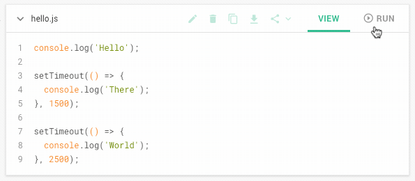
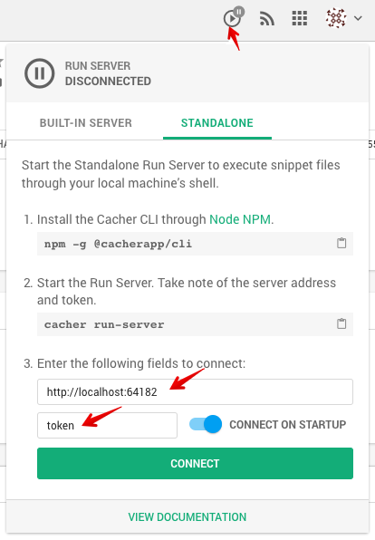
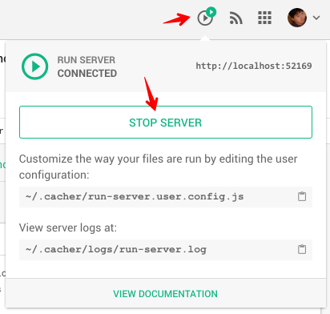

Cacher Run Server
=================

**Cacher Run Server**


[](https://npmjs.org/package/@cacherapp/run-server)
[](https://npmjs.org/package/@cacherapp/run-server)
[](https://github.com/cacherapp/cacher-run-server/blob/master/package.json)

The Cacher Run Server is a standalone [Socket.io](https://socket.io/)-based server that allows clients to run shell
commands via Websocket messages. It is used primarily to run snippets of code on the local user's machine via 
[Cacher](https://www.cacher.io/).

Demo of a [Cacher](https://www.cacher.io/) snippet file executing on a Run Server:



## Contents

* [Starting the Server](#starting-the-server)
  * [Built-in Mode](#built-in-mode)
  * [Standalone Mode](#standalone-mode)
* [Editing the Configuration](#editing-the-configuration)
  * [Rule Properties](#rule-properties)
  * [Arguments](#arguments)
  * [Testing your changes](#testing-your-changes)
* [Contributing](#contributing)
  * [Development](#development)
  * [Pull Requests](#pull-requests)
* [Libraries Used](#libraries-used)
* [Author / License](#author-license)

## Starting the Server

### Built-in Mode

The [Cacher Desktop Client](https://www.cacher.io/?dl=auto) comes with the Run Server built-in. Open the Run Server 
dialog and click **Start Server**:


### Standalone Mode

Start the Run Server in standalone mode if you need more control over its configuration.

#### Using the Cacher CLI

**Start server locally**

```bash
npm i -g @cacherapp/cli
cacher run-server:start
```

**Starting the server on a remote machine**

Running a remote server ensures all your developers are able to run snippet file commands against the same 
environment.

**Note:** Since the commands will be run using the shell account from which you launch the CLI, we recommend
you use only machines which are for testing or are ephemeral (i.e. Docker instances).

Example of launching with a secure tunnel ([ngrok](https://ngrok.com/)).
```
npm i -g @cacherapp/cli
cacher run-server:start -p 39135 -t 4D5dzRGliafhGg~btNlR9 -o file:// -v
ngrok http 39135
```

#### Via Javascript

Install the NPM package to your project.

```bash
npm i --save @cacherapp/run-server
```

A few examples (in Javascript) of starting the Run Server:

```javascript
// examples.js
const RunServer = require('@cacherapp/run-server').RunServer;

// Let server pick random port and token
(new RunServer(
  { origin: 'https://app.cacher.io' }
)).start();

// Specify port and token, log verbose output to file
(new RunServer(
  {
    origin: 'file://',
    port: 43193,
    token: 'secret_token',
    verbose: true,
    logToFile: true
  }
)).start(); 
```


**Connecting to the standlone server**

You'll need either the [Cacher Web App](http://app.cacher.io/) or the [Desktop Client](https://cacher.io?dl=auto) in 
order to connect to a standalone Run Server.

Once you've logged in, open the Run Server dialog. Input your server's port and token and press **Connect**.

 

## Editing the Configuration

The Run Server uses 2 config files to define the set of rules which govern how different file extensions are mapped
to shell commands:

- [config.default.js](src/config/config.default.js) - The default set of file types -> shell command mappings. While
this file is copied to the Cacher directory as `~/.cacher/run-server.config.js`, you should never edit this file. If you 
would like to add a file handler to this config (and let everyone use it), please submit a pull request instead. See 
the [Contributing](#contributing) section below.

- **`~/.cacher/run-server.user.config.js`** - Edit this file to add or overwrite handlers for file extensions. Here are a
few examples of new functions you might add to handle file types:

**Add command for `.awesome` file extension.**

```javascript
// ~/.cacher/run-server.user.config.js

module.exports = {
  rules: [
    {
      pattern: '\.awesome$',
      run: (command, filepath) => `awesome-compiler "${filepath}"`
    },
    ...
  ]
}
```

**Compile `.md` (Markdown) file into HTML, then display in default browser.**

```javascript
// ~/.cacher/run-server.user.config.js

// Requires `npm -g markdown` to be run first.
module.exports = {
  rules: [
    {
      pattern: '\.md$',
      run: (command, filepath, args) => {
        const outputHtmlFile = `${args.runDir}/${args.baseFilename}.html`;
        childProcess.execSync(`md2html ${filepath} > ${outputHtmlFile}`);
        opn(outputHtmlFile);

        // Must return a shell command
        return `echo "Generated '${outputHtmlFile}'" and opened in default browser`;
      }
    },
    ...
  ]
}
```

**Match Javascript file by both file extension (.js) and content. Calls `nvm use [version]` before executing script.**

```javascript
// ~/.cacher/run-server.user.config.js

module.exports = {
  rules: [
    {
      pattern: (command) => {
        return /\.js$/.test(command.file.filename)
          && command.file.content.indexOf('//nvm:') >= 0;
      },
      run: (command, filepath) => {
        let nvmVersion = command.file.content.match(/(\/\/nvm: v(.+))/)[0]
          .replace('//nvm: ', '');

        return `export NVM_DIR=~/.nvm ` +
          `&& source ~/.nvm/nvm.sh` +
          `&& nvm use ${nvmVersion} ` +
          `&& node "${filepath}"`;
      }
    },
    ...
  ]
}
```

### Rule Properties

**`pattern: (String|Function)`**

Indicates whether to execute the `run()` callback for the given command. Pass it either a 
[Regex](https://developer.mozilla.org/en-US/docs/Web/JavaScript/Guide/Regular_Expressions) string or function that 
takes a `command` object and returns a boolean. 

Pass it:
- [Regex](https://developer.mozilla.org/en-US/docs/Web/JavaScript/Guide/Regular_Expressions) string that matches against
the filename.
- Function that takes a `command` object and returns a boolean. 

Examples:
```javascript
// Matches files which end in .rb
pattern: '/\.rb$/'

// Match command which has "foobar" in the file's content
pattern: (command) => command.file.content.indexOf('foobar') >= 0
```

---

**`run: (Function)`**

Takes `command`, `filepath` and `args`. Returns a string that is run against the user's shell. For interpreted 
(non-compiled) languages, you'd generally have the function return `[interpreter] "${filepath}""`. For compiled
languages, you'll need to compile the first before running the binary.

Examples:
```javascript
// Run .dart file with interpreter
run: (command, filepath) => `dart "${filepath}"`

// Compile C++ file and run binary
run: (command, filepath, args) => {
  const outputFile = `${args.runDir}/${args.baseFilename}.out`;
  return `g++ "${filepath}" -o "${outputFile}" && cd "${args.runDir}" && ./"${args.baseFilename}.out"`;
}
```  

---

**`timestamp: (Boolean)`**

Whether to append a epoch timestamp to the end of the filename. This helps to prevent files from being overwritten in
the `~/.cacher/run` folder. You'll want to disable this for some languages which require a strict match between the
filename and the compiled binary. 

### Arguments

**`command (Object)`**

The object that is sent to the `pattern:` and `run:` callback functions.

Properties:

- `channel` - WebSocket channel for the command
- `file.filename` - Filename with extension (i.e. `example_code.cs`)
- `file.filetype` - Type of the file (i.e. `markdown`, `lisp`)
- `file.content` - The file's content which will be executed

---

**`filepath (String)`**

Passed to the `run:` callback. The full path for the file to be run (in the `~/.cacher/run` folder). If `timestamp` is 
`true`, this path includes an appended timestamp.

---

**`args (Object)`**

Additional arguments sent to the `run` callback function.

Properties:

- `runDir` - The fully resolved path to `~/.cacher/run`.
- `baseFilename` - The filename without the file extension. This is necessary sometimes to execute the binary. 
(i.e. `java "${args.baseFilename}"`)

### Testing your changes

#### With built-in server on Cacher's Desktop Client

1. Stop the built-in server.

 

2. Make the necessary changes to `~/.cacher/run-server.config.js`.

3. Start the built-in server again.

 

#### With standalone server

1. Install the [Cacher CLI](https://github.com/cacherapp/cacher-cli) globally:

```bash
npm i -g @cacherapp/cli
```

2. Make your changes to `~/.cacher/run-server.config.js`.

3. Start the server:

```bash
cacher run-server:start
```

Make note of the server port and token, then connect with the Cacher client.

 

## Contributing

### Development

Grab the source code for this repo:

```bash
git clone git@github.com:CacherApp/cacher-run-server.git
```

Install [Typescript](https://www.npmjs.com/package/typescript) globally:

```shell
npm i -g typescript
```

Install packages and start development server:

```shell
npm i
npm start
```

### Pull Requests

We are happy to review any pull requests for this project, especially for new filetypes defined in 
[config.default.js](src/config/config.default.js). Please be sure to review the 
[contribution guidelines](CONTRIBUTING.md) before submitting your pull request.

## Libraries Used

- [socket.io](https://socket.io/) - Websocket server implementation
- [nanoid](https://github.com/ai/nanoid) - Unique string ID generator
- [winston](https://github.com/winstonjs/winston) - Logger for everything
- [shelljs](https://github.com/shelljs/shelljs) - Portable Unix shell commands
- [opn](https://github.com/sindresorhus/opn) - Beter node-open
- [chalk](https://github.com/chalk/chalk) - Terminal string styling
- [get-port](https://github.com/sindresorhus/get-port) - Get available TCP port

## Author / License

Released under the [MIT License](/LICENSE) by [Rui Jiang](https://github.com/jookyboi) of [Cacher](https://www.cacher.io).
